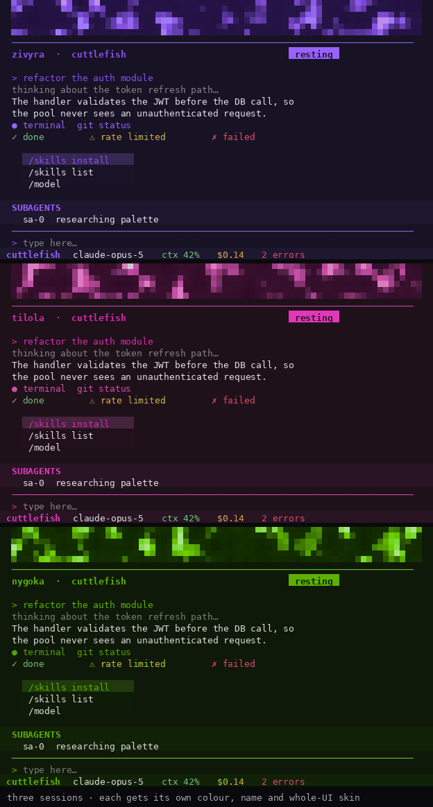
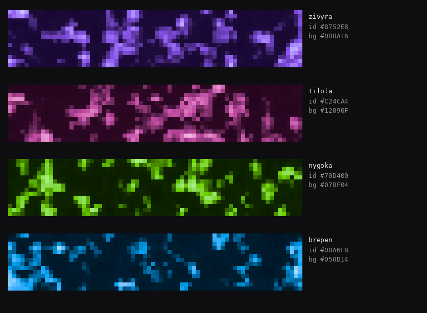
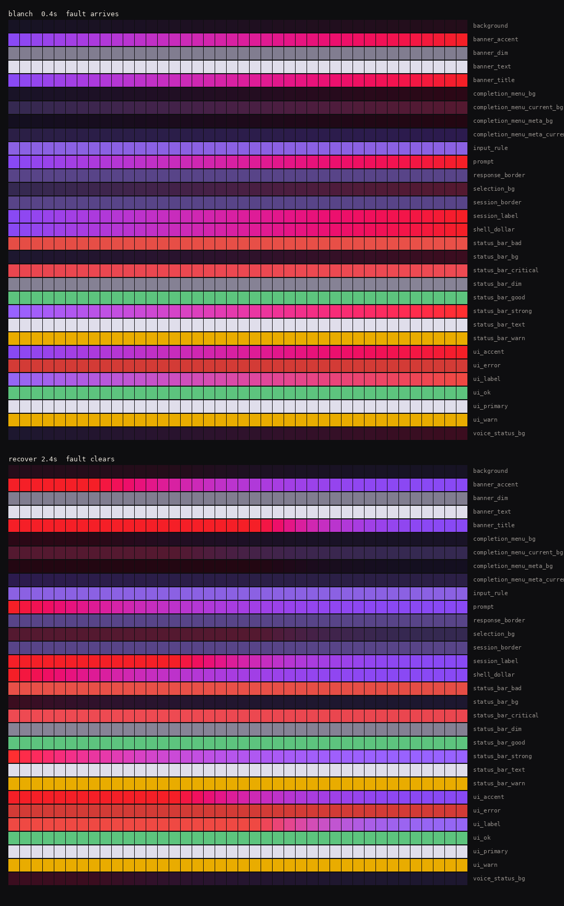

# cuttlefish-theme

Ambient session identity for [Hermes](https://github.com/NousResearch/hermes-agent), modelled on cuttlefish skin.

Every chat session gets its own colour, its own near-black mantle, and its own pronounceable name, held for the life of the session. When a session needs you, an acute signal **blanches** across the whole terminal — fast and direct, the way the animal does it — and is **released** again afterwards, the identity recovering underneath.



*Recorded from a real `hermes` session on a pty — the frames are replayed terminal bytes, not a mockup, so what you see is exactly what the terminal painted. The pixel block is the session's **mantle**: 900 chromatophore cells, a different pattern for every session.*

```
hermes cuttlefish watch      every session at once
hermes cuttlefish skin       this session's chromatophore field
hermes cuttlefish demo       watch the transition curves
hermes cuttlefish legend     learn the language in one screen
hermes cuttlefish doctor     what your terminal can do
```

## Why

Three problems, in the order they bite:

1. **Every session looks the same.** With six terminals open you cannot tell which is which without reading.
2. **You cannot see state at a glance.** Which one is blocked on you? For how long?
3. **Status bars are ugly.** A tool you look at all day should be beautiful.

## The language

Cuttlefish layer two kinds of pattern (Hanlon & Messenger, 1988). We use the same split, because it maps exactly onto the two jobs above:

| | lasts | carries |
|---|---|---|
| **chronic** | minutes to hours | who this session is |
| **acute** | seconds | what it needs from you |

Every appearance is one rule:

```
PATTERN = CHRONIC(identity) + [ACUTE(signal) only when needed]
```

### Identity — endless, never doubling

Colours are not drawn from a fixed list; they are **allocated** in [OKLab](https://bottosson.github.io/posts/oklab/) by farthest-point sampling against the sessions that are live *right now*. The space is continuous, so it never runs out, and allocation maximises perceptual distance, so concurrent sessions never look alike.

Measured, 8 concurrent sessions: worst pairwise separation **0.16 OKLab**, zero flagged crowded.

Names are generated the same way — a phonotactic grammar, not a word list (155,520 forms, `name_space_size()` computes it rather than asserting it). `zivyra`, `tilola`, `nygoka`, `brepen`. Say them out loud; that is the point.

Both are deterministic via blake2b, so a session keeps its colour and name across reconnects. (Not Python's `hash()`, which is randomised per process and would rename your session every restart.)

### The three signals

Seven agent states collapse to three, because peripheral colour discrimination does not support seven categories:

| signal | from | shows |
|---|---|---|
| **resting** | idle, run, review, wave, jump | the session's own colour, no badge |
| **needs me** | waiting | amber + `INPUT 4m` |
| **fault** | failed | red + `ERROR 2m` |

`run` and `review` both mean *autonomous work, leave it alone* — a distinction that is useless from across a room.

**Age is text, never colour.** A hue cannot say "four minutes". So the label does.

## How it moves

**At rest, nothing moves.** A cuttlefish holds its pattern; so does your terminal. All motion is in the *transitions*, and every curve is a reading of measured behaviour from Woo et al., [*The dynamics of pattern matching in camouflaging cuttlefish*](https://www.nature.com/articles/s41586-023-06259-2), Nature 619 (2023):

| trajectory | when | shape | why |
|---|---|---|---|
| **blanch** | a signal arrives | 0.4s, synchronous, direct | *"Pattern motion during blanching was direct and fast, consistent with open-loop motion"* — the animal is not deliberating about a threat |
| **recover** | the signal clears | 2.4s, decelerating, staggered onsets | *"blanching motion was fast; recovery was slower with gradual deceleration"* (Fig. 5b); Fig. 5g shows components restarting at different, reliable times |
| **settle** | a session begins | 1.6s, meandering, pausing | *"each search meanders ... decelerating and accelerating repeatedly before stabilizing"*, and *"the number of successive low-velocity regions increased as the skin approached its target"* |

The intermittent pauses in `settle` are why it reads as alive rather than as an animation — no easing function produces that profile.

**Components regroup on every transition.** The paper's fourth finding is that pattern components *"are not stable entities and can be defined only over specific segments of activity"*: the same chromatophores group differently on each traversal, even between identical start and end patterns. `morph.components()` re-partitions the palette on every transition, seeded by (session, transition ordinal), so the same state change never animates the same way twice. It costs one hash.

### Release, not replacement

When a fault clears, the identity returns. This is [blanching](https://www.nature.com/articles/s41586-023-06259-2): the animal pales at a threat, *retains a trace of its prior pattern*, and returns to it — in 16 of 17 measured trials. The acute layer overrides identity; it never destroys it.

## The pixels

The skin engine exposes **28 semantic colour keys** — `ui_error`, `banner_border`. That is a palette, not a canvas: `ui_error` must stay red or the signal channel is destroyed, so you cannot address it as a pixel.

So the real chromatophore grid is text we emit ourselves, at truecolor, using `U+2580` half-blocks — **two independently coloured pixels per character cell**. Each cell is one chromatophore with an expansion state in 0..1, exactly as in the animal, composited as pigment over structural colour:

```
leucophore/iridophore  (revealed when the sac retracts)
   ^ chromatophore     (pigment, expansion 0..1)
```

That layering is most of the difference between "coloured squares" and skin. A retracted cell does not go to black — it reveals a cooler glint of the layer beneath.

The distribution matters as much as the colours: **~89% of cells sit near the ground**, a minority expand strongly, and per-cell grain keeps them discrete. Two earlier versions of this composite lifted the retracted floor too hard (0.55, then 0.16 of the gap to the sheen) and washed the whole field to a flat pastel midtone. It is 0.045 now. The dark is supposed to be dark.

`passing_cloud()` reproduces the travelling band of *S. officinalis* — ~1 Hz hunting display, 0.38 Hz for the agonistic one — as a raised cosine, with **exactly one band visible at a time** (Laan et al. 2014: the wavelength matches the travel length), plus *Metasepia*'s "blink": a transient local intensity drop while the band keeps propagating underneath.

## The background

The VTE has no wallpaper surface available to a plugin. The field therefore lives in printed blocks, banner/logo markup, and chrome; empty scrollback remains the terminal's uniform ground. The session ground is a shared near-black (`OKLab L=0.155`, `C=0.008`, hue 270°), so identity is carried by chromatophore cells rather than six subtly different blacks.

The six deterministic body patterns are **uniform fine mottle**, **coarse mottle**, **transverse stripes/zebra**, **passing cloud bands**, **disruptive patches**, and **pearl scatter**. Each is built from the field's coherent value-noise octaves and selected by the session's blake2b seed.

This plugin has two tiers. **Tier A** works on every Hermes core: single-colour skin chrome plus Rich-rendered banner/logo and separator rows after responses. **Tier B** writes the whole-string `input_rule_art` skin data field (a 200-cell chromatophore separator); older cores ignore that unknown field and keep the plain rule.

Turn off `tint_background` if you have a strong terminal theme of your own.

## What it looks like

Every session gets a chromatophore field — a real pixel grid, two pixels per character cell, composited as pigment over structural colour:



The transition curves, as live colour bars. Blanch is abrupt and synchronous; recovery decelerates and staggers its components:



## Install

```bash
git clone https://github.com/wisechef-ai/cuttlefish-theme ~/.hermes/plugins/cuttlefish-theme
hermes plugins enable cuttlefish-theme
```

No core changes. It registers a CLI command and two session hooks through the documented plugin surface, and declines tool-override privileges because it does not need them.

## Settings

Under `plugins.entries.cuttlefish-theme.settings` in `config.yaml`:

| key | default | what |
|---|---|---|
| `animate` | `true` | animate transitions; `false` restores a hard snap |
| `tint_background` | `true` | per-session near-black mantle |
| `fps` | `24` | transition frame rate |
| `watch_interval` | `2.0` | seconds between state checks (no repaint unless something changed) |
| `banner` | `true` | print the chromatophore field at session start |
| `banner_height` | `8` | pixel rows (renders as half that in text rows) |

## How the live repaint works

The documented "write the skin YAML and everything repaints" path runs in the gateway watcher and **does not reach the classic CLI** — that watcher only starts inside `tui_gateway`. What does work, verified against the live install:

```python
skin_engine.set_active_skin(name)   # re-reads the YAML from disk
cli._apply_tui_skin_style()         # app.style = ...; app.invalidate()
```

`_build_tui_style_dict` calls `get_prompt_toolkit_style_overrides()` on every invocation, so re-activating picks up a rewritten file immediately. We reach the running application through prompt_toolkit's own `get_app_or_none()`, which is why this stays a plugin rather than a patch.

### The frame budget, measured

On the reference box, against the real engine:

| step | cost |
|---|---|
| atomic write + fsync | 4.1 ms |
| `set_active_skin` | 7.4 ms |
| style rebuild | 0.2 ms |
| **total** | **11.7 ms** (~85 Hz ceiling before prompt_toolkit's own redraw) |

Dropping the fsync for *in-flight* frames takes the write to 0.3 ms. That is safe and deliberate: **atomicity comes from `os.replace`, not from fsync**, so a concurrent reader still sees the whole old file or the whole new one. fsync buys crash *durability*, and the thing that should survive a crash is the final frame — which is always written durably.

Idle costs one registry read every 2 s and **nothing else**: no write, no activation, no invalidate. (v1 ran a fixed 0.125 Hz repaint forever, which was both the wrong biology and a permanent tax.)

## Safety

Writes are **atomic** (temp + fsync + rename), and this is not optional. Hermes' watcher records a skin file's mtime *before* parsing it, and a parse failure silently falls back to the default skin — so a torn read does not glitch, it **latches**.

Skin files are **fully materialized**. Hermes merges a skin over the built-in default, not over another skin, so a sparse per-session file would inherit the wrong palette. Every animation frame carries every key for the same reason.

Cleanup is defensive: session end restores the previous skin only if we still own the active one (compare-and-set, so a manual `/skin` wins), and an orphan sweep on start reclaims files left by sessions that died without cleanup.

A failing frame is logged and skipped rather than aborting the transition — the final commit guarantees we land on the target regardless. `stop()` interrupts an in-flight transition immediately, so session end never waits on a 2.4 s recovery.

`watch` is strictly read-only.

## Tests

```bash
make test        # lint + suite + all proofs
```

134 unit tests, plus three proofs against the real Hermes install:

- `tests/proofs/animated_repaint_proof.py` — a real `prompt_toolkit` Application, driven by the real skin engine. Verifies that a blanch emits 13 distinct styles in 0.41 s, a recovery 73 in 2.41 s, that recovery is measurably slower than blanching, that the identity is restored exactly, and that **idle ticks repaint nothing**.
- `tests/proofs/live_repaint_proof.py` — the chronic/acute cycle against the real skin engine.
- `tests/proofs/running_app_proof.py` — the CLI-resolution path.

`tools/render_preview.py` rasterises the field to PNG, using the same compositor as the terminal, for judging appearance without a tty.

### A note on `pytest.ini`

`--import-mode=importlib` **and** `consider_namespace_packages` are both required (either alone gives 76 collection errors). The repo root *is* the package and its directory name contains a hyphen, which is not a legal Python module name. Production never hits this: `plugins_loader._directory_module_name()` slugifies the manifest key and binds the module through `spec_from_file_location`, so Hermes loads us as `hermes_plugins.cuttlefish_theme`.

## License

MIT
